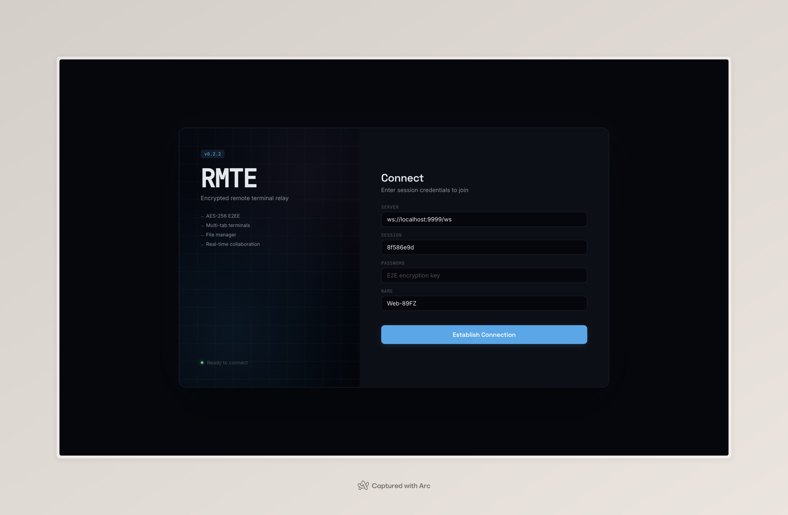
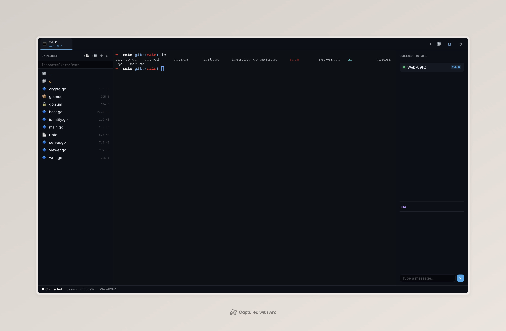

# RMTE — Remote Terminal Relay & Cloud IDE (v0.3.0)

> "I love sshx, but my endless curiosity to build it from scratch got the best of me 🥲"

RMTE is a secure, real-time, multi-user remote terminal sharing system and lightweight Cloud IDE. It is built entirely in Go with a centralized WebSocket relay architecture, securing all traffic with **AES-GCM 256-bit End-to-End Encryption (E2EE)**.

It allows hosts to share terminal sessions, navigate directories using a clean absolute-path File Explorer, and edit files in real-time via a multi-tab Web UI or an interactive TUI-based CLI client—all packed into a single binary.

---

## Screenshots

### Login


### IDE Workspace


---

## ✨ Key Features

* **Absolute Privacy (AES-GCM 256-bit):** Encryption keys and terminal/file I/O payloads are processed locally. The central relay server acts as a "dumb pipe" that only routes encrypted binary frames. It never sees your plaintext data, your files, or your password.
* **Single-Command Setup:** Run `rmte serve --pass="secret"` to start both the relay server and host session in one process. A shareable link is printed automatically.
* **HTTP Compatible:** Works on plain HTTP (no HTTPS required). A built-in crypto polyfill (asmcrypto.js) handles AES-GCM when `crypto.subtle` is unavailable.
* **Shareable Links & Auto-fill UI:** Running a host session generates a web URL with pre-filled `?server=` and `?session=` parameters. The Web UI parses these and auto-focuses the password input for seamless onboarding.
* **Modern Web Redesign:** A sleek, split-viewport interface using OKLCH atmospheric themes, Space Grotesk/Inter/JetBrains Mono typography, and portable CSS design tokens (`tokens.css`).
* **Split-Workspace Cloud IDE:** Toggle the folder icon `📁` in the browser tab bar to open a split-view workspace:
  * **Left Panel**: Advanced File Explorer.
  * **Right Panel**: Tabbed text editor supporting file opening, modification warnings, and direct saving (`Ctrl + S`).
  * **Bottom Panel**: Interactive, multi-tab terminal shells.
* **Modern File Explorer & Manager:**
  * **Absolute PWD Display**: Displays the full, absolute working directory of the host (e.g. `C:/workspace/rmte`) with forward slash consistency.
  * **Editable Path Breadcrumbs**: Double-click the path header to type/edit the absolute folder path directly, then press `Enter ↵` to jump.
  * **Parent Navigation (`..`)**: An always-visible `..` folder item at the top of the file list allows walking backward up the host's directory structure.
  * **Inline Operations (Zero Browser Modals)**: Creating new files (`+📄`) or folders (`+📁`), renaming (`✏️`), and deleting (`🗑`) are performed via inline text inputs and non-intrusive confirmation strips (`[Yes] [No]`).
  * **Toast Notification HUD**: Directory and workspace errors are reported through transient, auto-dismissing inline Toasts.
* **Dynamic Max Buffer Limits:** Set customizable memory limits via CLI (e.g. `--buffer=5` for 5MB limits) to configure both the terminal ring buffer and the maximum allowed file sizes.
* **Zero-copy Binary Data Channel (Tab ID `255`):** Avoids heavy Base64 parsing overhead. Files are sent as pure, encrypted binary frames over a reserved channel.
* **Integrated Chat Room:** A memory-cached chat bridge connecting Web and CLI clients in real-time, preserving the last 50 messages.
* **Auto-Reconnect:** On unexpected disconnect, the web client retries with exponential backoff (2s → 4s → 8s → max 30s) with a live countdown in the status bar.
* **State Persistence & Auto-Reconnect:** Connection credentials live safely in `sessionStorage` for immediate recovery upon page refresh.

---

## 🏗️ Architecture & Security Model
```
┌───────────────┐                  ┌──────────────┐                  ┌───────────────┐
│               │  E2EE Control    │              │  E2EE Control    │               │
│               ├─────────────────►│              │◄─────────────────┤               │
│   Host Go     │                  │  Relay Go    │                  │  Viewer JS    │
│  Workspace    │  E2EE Tab 255    │  (WebSockets)│  E2EE Tab 255    │   Browser     │
│               │◄─────────────────┤              ├─────────────────►│               │
└───────────────┘  (Raw Binary)    └──────────────┘  (Raw Binary)    └───────────────┘
```

1. **E2EE Key Derivation**: A 256-bit key is derived locally from the shared password using SHA-256.
2. **AES-GCM Payload Envelope**: Control messages (JSON) and binary streams (terminal I/O & file operations) are encrypted using AES-GCM with a unique 12-byte initialization vector (IV) prepended to the ciphertext.
3. **Zero-Knowledge Relay**: The server only proxies binary envelopes and target routing IDs. It cannot read your commands, terminal outputs, or files.

---

## 📦 Build & Release

### Pre-built Binaries
Get the latest pre-built releases for your operating system directly from the GitHub releases page:
👉 **[RMTE GitHub Releases](https://github.com/yaelahan/rmte/releases)**

### Build from Source
Got Go installed (v1.21+)? Let's build the binary:
```bash
git clone https://github.com/yaelahan/rmte.git
cd rmte/rmte
go build -ldflags "-s -w" -o rmte
```

---

## 🚀 Quick Start Guide

### 1. All-in-One (Recommended)
Start the relay server and host session in a single command:
```bash
./rmte serve --pass="supersecret123"
```
Output:
```
Relay Server started on :8080
Session ID: a1b2c3d4
Buffer limit: 1 MB

Shareable link (password still required):
  http://localhost:8080/?server=ws%3A%2F%2Flocalhost%3A8080%2Fws&session=a1b2c3d4
```
Share the link with viewers — they just open it, enter the password, and connect.

### 2. Separate Server + Host (Advanced)
If you want to run the relay on a different machine:
```bash
# On the relay server
./rmte serve --port=8080

# On the host machine
./rmte share --server="ws://relay-server:8080/ws" --pass="supersecret123" --buffer=5
```

### 3. Join via CLI Client (Viewer)
Join from another terminal:
```bash
./rmte join --server="ws://localhost:8080/ws" --id="a1b2c3d4" --pass="supersecret123"
```
You'll enter an interactive TUI menu:
* `[j]` **Join Tab:** Dive into the active terminal shell (Press `Ctrl + ]` to escape).
* `[n]` **New Tab:** Spawn a concurrent shell on the host.
* `[s]` **Switch Tab:** Hop between active terminal tabs.
* `[c]` **Chat:** Enter the real-time chat room.
* `[q]` **Quit:** Disconnect gracefully.

### 4. Join via Web Client (Viewer)
Open the shareable link in your browser, or navigate to:
```
http://localhost:8080/
```
1. Enter the E2EE **Password** and click **Establish Connection**.
2. Toggle the folder icon `📁` in the tab bar to access the workspace editor.
3. Double-click the breadcrumb to input any absolute path directly.
